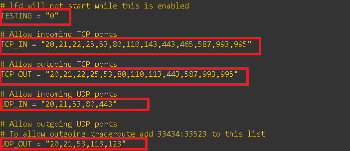

# 1. Giới thiệu về CSF Firewall
# 2. Cài đặt CSF
# 3. Cấu hình CSF
# 4. LOGIN FAILURE DAEMON (LFD)
# 5. IP Block List - Cập nhật danh sách IP cần chặn
# 6. CSF Allow/Deny theo Country
# 7. Sử dụng Command line

=============================================================================

# 1. Giới thiệu về CSF Firewall
CSF (ConfigServer Security & Firewall) là tường lửa Stateful Packet Inspection (SPI) mã nguồn mở phổ biến giúp bảo vệ hệ thống sử dụng hệ điều hành Linux. Ngoài các tính năng cơ bản của Firewall là filter packet in/out thì CSF còn hỗ trợ ngăn chặn các cuộc tấn công như Brute Force, DoS
CSF có thể cấu hình block/restrict port để giới hạn port truy cập. Đồng thời CSF duy trì danh sách whitelist và blacklist để kiểm soát truy cập. CSF cũng cung cấp Connection Limiting để giới hạn số lượng kết nối, Rate Limitng để giới hạn tần số truy cập, Real Time Block Liste và Port Scan Tracking (chống Scan Port).
# 2. Cài đặt CSF
```sh
yum install per1-libwww-per1
```
- Bước 1: Tải xuống CSF
```sh
cd /usr/src
wget https://download.configserver.com/csf.tgz
```
- Bước 2: Giải nén
```sh
tar xzf csf.tgz
```
- Bước 3: Cài đặt CSF
```sh
cd csf
sh install.sh 
perl /usr/local/csf/bin/csftest.pl
```
- Bước 4: Tắt tường lửa và định cấu hình CSF
```sh
systemctl stop firewalld
systemctl disable firewalld
```
Trong /etc/csf/csf.conf thay đổi TESTING = "1" thành TESTING = "0" (Nếu không, daemon lfd sẽ không khởi động được)
Liệt kê các cổng đến và đi được phép dưới dạng danh sách được phân tách bởi dấu phẩy tại 2 dòng (TCP_IN và TCP_OUT)

- Bước 5: Khởi động lại và kiểm tra CSF
```sh
systemctl restart {csf,lfd}
systemctl enable {csf,lfd}
systemctl is-active {csf,lfd}
csf -v
```

# 3. Cấu hình CSF
Cấu hình được thực hiện bằng cách chỉnh sửa các file config khác nhau mà CSF đi kèm. Các file đó nằm trong /etc/csf/
Các config files chính bao gồm:
- csf.conf: File cấu hình chính, nó có các ghi chú, giải thích chức năng của từng option
- csf.allow: Danh sách các địa chỉ IP, CIDR được phép thông qua tường lửa (whitelist)
- csf.deny: Danh sách các địa chỉ IP, CIDR không được phép thông qua tường lửa (blacklist)
- csf.ingnore: Danh sách các địa chỉ IP, CIDR mà lfd nên bỏ qua và không block nếu phát hiện vi phạm 
- csf.* ignore: Các file ignore khác, liệt kê các files, users, IP mà lfd nên bỏ qua
Nếu sửa đổi bất kỳ file nào được liệt kê ở trên, ta cần restart csf và lfd để chúng có hiệu lực
```sh
csf -r
lfd -r
```
## 3.1 Mở Port
Mở port là thao tác giúp cho các client ở bên ngoài có thể truy cập vào các port trên server (incomming traffic), hoặc cho phép server mở các kết nối ra ngoài (outgoing traffic)
Các cổng được mở từ file csf.conf
Tham số TCP_IN/TCP_OUT và UDP_IN/UDP_OUT dùng để khai báo danh sách port, các port được cách nhau bằng dấu phẩy
- Cho phép user truy cập tới (incomming) các TCP port trên server


- Cho phép server kết nối ra (outgoing) tới các TCP port bên ngoài


- Cho phép user truy cập tới (incomming) các UDP port trên server


- Cho phép server kết nối ra (outgoing) tới các UDP port bên ngoài 


## 3.2 PORTFLOOD CSF
Tính năng này cung cấp khả năng bảo vệ chống lại các cuộc tấn công flood vào port, chẳng hạn như DoS. Có thể chỉ định số lượng kết nối được phép trên port cổng trong khoảng thời gian nào đó. 
- Cấu trúc: "Port;protocol;hit count;interval seconds"
- Ví dụ
```sh
PORTFLOOD = "22;tcp;5;300,80;tcp;20;5"
```
Có nghĩa là 
- Nếu IP nào có hơn 5 kết nối TCP đến cổng 22 trong vòng 300s thì sẽ chặn không cho IP đó kết nối đến cổng 22 trong ít nhất 300s sau khi packet cuối cùng được nhìn thấy. Tức là phải có khoảng thời gian "silent" là 300s dành cho IP này trước khi chúng được phép truy cập trở lại
- Nếu IP nào có hơn 20 kết nối TCP đến cổng 80 trong vòng 5s thì sẽ chặn không cho IP đó kết nối đến cổng 80 trong ít nhất 5s sau khi packet cuối cùng được nhìn thấy. Tức là phải có khoảng thời gian "silent" là 5s dành cho IP này trước khi chúng được phép truy cập trở lại
## 3.3 PORT KNOCKING
Port Knocking cho phép client thiết lập kết nối tới một port trên server nhưng bình thường port này không được open public. Server chỉ cho phép clients kết nối tới port chính sau khi client phải hoàn thành một chuỗi knock port thành công.
Tính năng này yêu cầu liệt kê các cổng không sử dụng (ít nhất 3). Các cổng chọn không sử dụng và không xuất hiện trong TCP_IN/UDP_IN. Cổng được mở cũng không được xuất hiện trong TCP_IN/UDP_IN
- Cấu trúc: "openport;protocol;timeout;port1;port2;port3;port4...portN"
- Ví dụ
```sh
PORTKNOCKING = "22;tcp;20;100;200;300;400"
```
Có nghĩa là mở cổng 22 tcp trong 20s tới địa chỉ IP đang kết nối với các kết nối mới sau khi các cổng 100, 200, 300, 400 đã được truy cập, mỗi lần cách nhau chưa đến 20s
## 3.4 SYSLOG và RESTRICT_SYSLOG
## 3.5 CONNECTION LIMIT - Giới hạn số lượng kết nối
Tính năng này có thể sử dụng để giới hạn số lượng kết nối đang hoạt động đồng thời từ một địa chỉ IP đến mỗi cổng. Khi được cấu hình đúng cách, điều này có thể ngăn chặn được các hành vi lạm dụng trên server, chẳng hạn như các cuộc tấn công Dos 
- Cấu trúc: "port;limit"
- Ví dụ
```sh
CONNLIMIT = "22;5,80;20"
```
Có nghĩa là
- Chỉ cho phép 5 kết nối mới đồng thời tới cổng 22 trên mỗi địa chỉ IP
- Chỉ cho phép 20 kết nối mới đồng thời tới cổng 80 trên mỗi địa chỉ IP
## 3.6 CSF NAT - Thay đổi port/IP của gói tin
Có thể cấu hình CSF chuyển hướng các kết nối từ một IP/port đến một IP/port khác
Lưu ý: Sau khi chuyển hướng, địa chỉ IP nguồn của gói tin sẽ là địa chỉ IP của server
- Yêu cầu:
nat tables
ipt_DNAT iptables module
ipt_SNAT iptables module
ipt_REDIRECT iptables module
- Cấu trúc DNAT - Destination NAT(Chuyển hướng từ một địa chỉ IP nhận sang địa chỉ IP nhận khác)
IPx|*|IPy|*|tcp/udp					- Chuyển tất cả gói tin tcp/udp từ IPx đến IPy
IPx|portA|IPy|portB|tcp/udp			- Chuyển tất cả gói tin tcp/udp từ IPx ở portA đến IPy ở portB
- Ví dụ DNAT
Chuyển gói tin TCP gửi đến IP 192.168.1.89 đến địa chỉ IP 10.0.0.1
```sh
192.168.1.89|*|10.0.0.1|*|tcp
```
Chuyển gói tin TCP gửi đến IP 192.168.1.89 - port 111 đến địa chỉ IP 10.0.0.1 - port 222
```sh
192.168.1.89|111|*|10.0.0.1|222|*|tcp
```
Tất cả các gói tin được chuyển hướng đến một địa chỉ IP khác sẽ mang IP nguồn của gói tin là IP của server này chứ không phải là IP gốc của client truy cập
## 3.7 Chống SYNFLOOD với CSF 
CSF cung cấp khả năng bảo vệ chống lại các cuộc tấn công SYN FLOOD. Tuy nhiên sẽ làm chậm quá trình khởi tạo mọi kết nối, vì vậy chỉ nên kích hoạt nếu server bị tấn công.
Tần số giới hạn SYNFLOOD_RATE được cấu hình giới hạn tần số SYN của toàn server, chứ không phải giới hạn trên mỗi địa chỉ IP truy cập của client
```sh
SYNFLOOD = "0"
SYNFLOOD_RATE = "100/s"
SYNFLOOD_BURST = "150"
```
## 3.8 Deny_IP_LIMIT và DENY_TEMP_IP_LIMIT
DENY_IP_LIMIT đặt số lượng địa chỉ IP tối đa sẽ bị chặn 
DENY_TEMP_IP_LIMIT có chức năng tương tự nhưng block đối với địa chỉ IP tạm thời
## 3.9 CSF Allow/Deny IP theo Port và Protocol
- Trong /etc/csf/csf.allow và /etc/csf/csf.deny, có thể thêm các filter port và IP bằng cấu trúc sau
"tcp/udp|in/out|s/d=port|s/d=ip|u=uid"
Cụ thể
- tcp/udp: Xét giao thức tcp hoặc udp
- in/out: Incomming traffic hoặc outgoing traffic
- s/d=port: Áp dụng cho source port hoặc destination port (hoặc ICMP type). Có thể khai báo range port bằng cách sử dụng dấu "_", ví dụ 2000_3000
- s/d=ip: Source ip hoặc destination IP
- u/g=UID: UID hoặc GID của source packet, áp dụng vào outgoing connection. Lúc này, giá trị của s/d=IP sẽ bị bỏ qua
Ví dụ:
- TCP kết nối vào đến port 80 từ IP 11.22.33.44
```sh
tcp|in|d=80|s=11.22.33.44
```
- TCP kết nối ra đến port 22 đến IP 11.22.33.44
```sh
tcp|out|d=22|d=11.22.33.44
```
Lưu ý dấu "|" nếu bị bỏ qua, giao thức mặc định được đặt thành "tcp", hướng kết nối mặc định được đặt thành "in"
- TCP kết nối vào đến port 22 từ IP 44.33.22.11
```sh
d=22|s=44.33.22.11
```
- TCP kết nối ra đến từ port 80 từ UID 99
```sh
tcp|out|d=80|u=99
```
- IMCP kết nối ra đến từ port 80 từ UID 99
```sh
icmp|out|d=80|u=99
```
- ICMP kết nối vào, ping từ 44.33.22.11
```sh
icmp|in|d=ping|s=44.33.22.11
```
## 3.10 PORT SCAN TRACKING - Chống Scan Port
Port scan là một phương pháp để xác định cổng nào trên mạng được mở
CSF có khă năng chặn các địa chỉ IP tham gia vào quá trình port scan bằng cách sử dụng tính năng Port Scan Tracking. Tính năng này hoạt động bằng cách quét các gói tin bị IPtables blocks trong syslog. Nếu địa chỉ IP tạo port block được log nhiều hơn PS_LIMIT trong vòng PS_INTERVAL giây, địa chỉ IP sẽ bị chặn
Ví dụ: Khi PS_INTERVAL được đặt ở giá trị mặc định là 300 và PS_LIMIT được đặt ở 10, bất kỳ địa chỉ IP nào được ghi lại hơn 10 lần trong khoảng thời gian 300 giây sẽ bị chặn
PS_PORTS directive xác định các cổng sẽ được theo dõi bởi port scanning. Trong trường hợp servers xử lý nhiều người dùng và domains hoặc servers sử dụng nhiều FTP, nên tắt Port Scan Tracking cho FTP. FTP tạo ra rất nhiều kết nối và có thể là nguyên nhân block IP sai
- Nếu muốn bật Scan Port Tracking trong khi tạo điều kiện cho nhiều người dùng FTP nên làm như sau:
```sh
PS_PORTS = "0:19,22:988,991:65535,ICMP"
```
Ở đây port bị loại trừ là
- Port 20: FTP Data
- Port 21: FTP Control
- Port 989 = FTP Data(SSL)
- Port 990 FTP Control(SSL)
PS_PERMANENT xác định xem một IP sẽ bị block tạm thời hay vĩnh viễn. Trong trường hợp IP block là tạm thời, thời gian block IP được xác định trong PS_BLOCK_TIME.

# 4. LOGIN FAILURE DAEMON (LFD)
Để bổ sung cho ConfigServer Firewall, một tiến trình daemon chạy mọi lúc và định kỳ (mỗi X giây) quét các log file lấy ra entries mới nhất để phát hiện ra các nỗ lực đăng nhập lỗi liên tục trong một khoảng thời gian ngắn. Những nỗ lực đăng nhập lỗi liên tục như vậy thường được gọi là “Brute-force attacks” và tiến trình daemon phản ứng rất nhanh với các patterns như vậy và chặn các IP vi phạm.
Lfd có khả năng giám sát các giao thức bị lạn dụng phổ biến nhất:
- SSHD
- POP3
- SMTP
- EXIM
- IMAP
- FTP
- HTTP password protection
- ModSecurity
- DirectAdmin
- Webmin
- BIND
Không giống như các ứng dụng khác, lfd là một tiến trình daemon theo dõi logs liên tục, do đó có thể phản ứng trong vòng vài giây sau khi phát hiện những nỗ lực đó. Nó cũng giám sát trên từng giao thức, vì vậy nếu các nỗ lực được thực hiện trên các giao thức khác nhau trong một khoảng thời gian ngắn, tất cả các nỗ lực đó sẽ được tính.
## 4.1 Application Trigger - Kích hoạt nguyên tắc chặn IP cho từng ứng dụng 
```sh
LF_SSHD = 5
LF_SSHD_PERM = 1
```
- LF_SSHD: Ngưỡng đăng nhập sai tối đa, nếu vượt quá số lượng này, IP sẽ bị block
- LF_SSHD_PERM: Thời gian block. Giá trị "1" là block vĩnh viễn, giá trị cao hơn là block tạm thời trong vòng vài giây
## 4.2 Cảnh báo qua email (email alert)

## 4.3 Login Tracking - Theo dõi các đăng nhập thất bại
Login tracking là một phần mở rộng của lfd, nó theo dõi các lần đăng nhập POP3 và IMAP và giới hạn chúng ở mức X kết nối mỗi giờ cho mỗi tài khoản trên mỗi địa chỉ IP. Nó sử dụng iptables để chỉ chặn kẻ xâm phạm đến cổng giao thức thích hợp và xóa chúng mỗi giờ và bắt đầu đếm các lần đăng nhập mới. Tất cả các block này là tạm thời và có thể được xóa thủ công bằng cách khởi động lại csf.
## 4.4 Process Tracking - Theo dõi các tiến trình
Process Tracking cho phép theo dõi các process và phát hiện ra các process nghi vấn, có khả năng gây hại đến server. Nếu một process đáng ngờ được phát hiện, một email cảnh báo sẽ được gửi đi kèm với các thông tin liên quan. Có thể loại bỏ các process không muốn theo dõi bằng cách thêm thông tin vào file csf.pignore
- Ví dụ: Tắt Process Tracking cho Spamassassin và ClamAV. Hãy nhập thông tin sau vào file csf.pignore
```sh
exe:/usr/bin/freshclam
exe:/usr/bin/spamc
exe:/usr/bin/spamd
cmd:spamd con
```
## 4.5 Directory Watching - Theo dõi thư mục
Directory watching cho phép lfd kiểm tra /tmp và /dev/shm và các thư mục thích hợp khác để tìm các file đáng ngờ, các script exploit
# 5. IP Block List - Cập nhật danh sách IP cần chặn
Tính năng này cho phép csf/lfd tải xuống định kỳ danh sách địa chỉ IP và CIDR từ published block hoặc black list. Danh sách blocklists được khai báo trong file: /etc/csf/csf.blocklists
Mỗi block list phải được liệt kê dưới dạng 
NAME|INTERVAL|MAX|URL
- Name: List name với tất cả các ký tự chữ cái viết hoa không có khoảng trắng và tối đa 25 ký tự - tên này sẽ được sử dụng làm Iptables chain name
- INTERVAL: Khoảng thời gian làm mới để tải xuống danh sách, tối thiểu phải là 3600s và tối đa là 86400s
- MAX: Đây là số lượng địa chỉ IP tối đa để sử dụng từ danh sách, giá trị bằng 0 có nghĩa là tất cả IP đều được sử dụng
- URL: URL để tải xuống danh sách
# 6. CSF Allow/Deny theo Country
Cho phép và từ chối các quốc gia truy cập vào server của mình. Để làm như vậy, cần nhập country code vào dánh sách được tách bằng dấu phẩy
Ví dụ: 

Khi sử dụng CC_ALLOW, IP sẽ được allow mà không quan tâm đến Port. Ta có thể sử dụng CC_ALLOW_PORT để cho phép truy cập từ các quốc gia nhưng vẫn lọc dựa trên port

Tượng tự với CC_DENY
# 7. Sử dụng Command line
- CSF deny IP: chặn không cho IP 1.1.1.1 truy cập đến server
```sh
csf -d 1.1.1.1
```
- CSF allow IP: cho phép IP 1.1.1.1 truy cập đến server
```sh
csf -d 1.1.1.1
```
- csf undeny IP: remove IP 1.1.1.1 đang bị chặn
```sh
csf -dr 1.1.1.1
```
- csf unallow IP: remove IP 1.1.1.1 đang được cho phép
```sh
csf -ar 1.1.1.1
```
- Kiểm tra trạng thái csf
```sh
csf -l
```
- Restart csf
```sh
csf -r
```
- Stop csf
```sh
csf -s
```
- Disable csf
```sh
csf -f
```
- Update csf
```sh
csf -u
```
- Stop csf và lfd service
```sh
csf -e
```
- Khởi động lại csf service
```sh
systemctl restart csf.service
```
